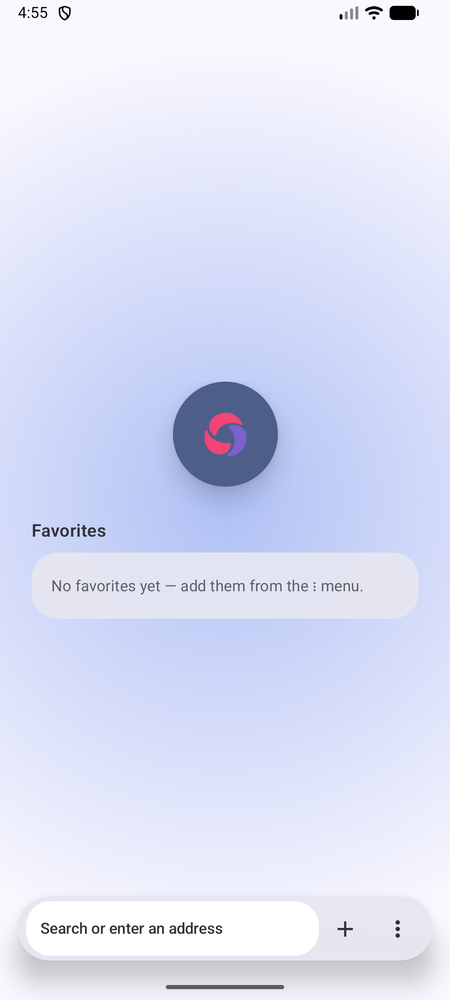
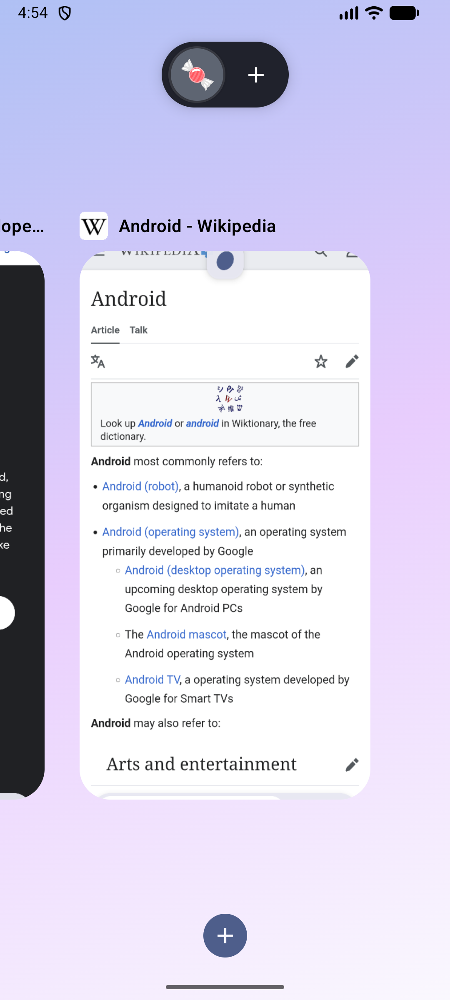
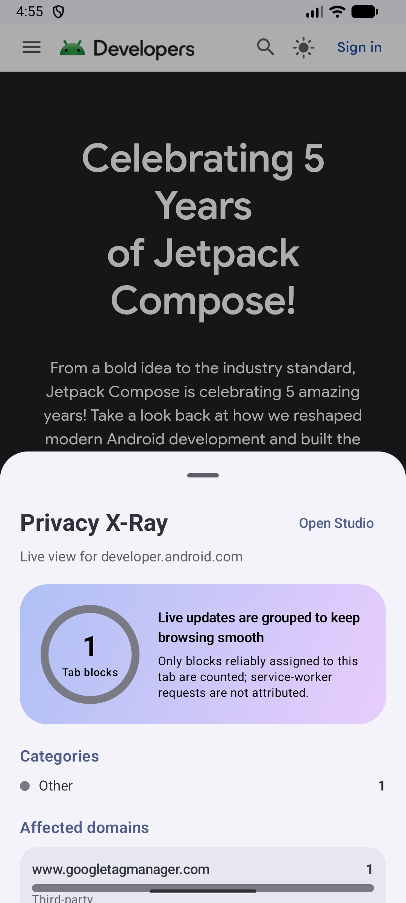
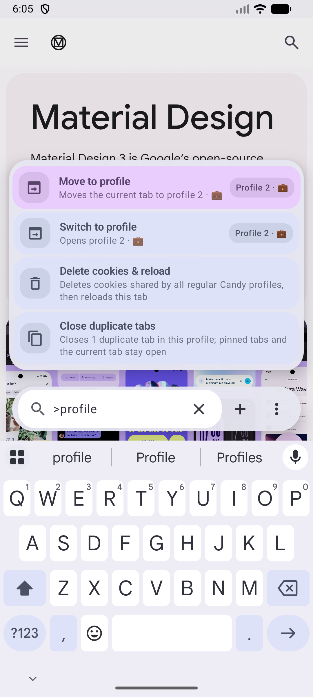
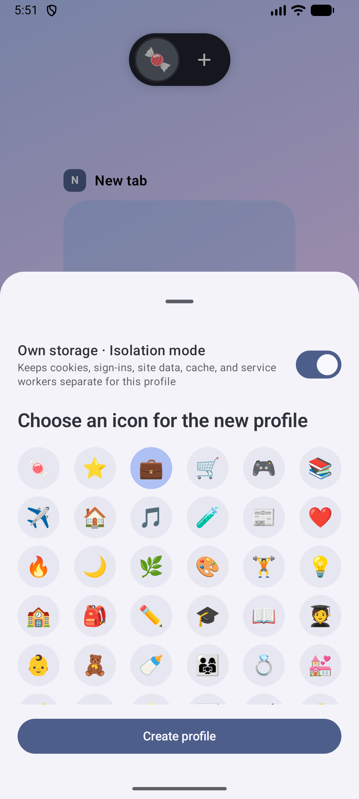
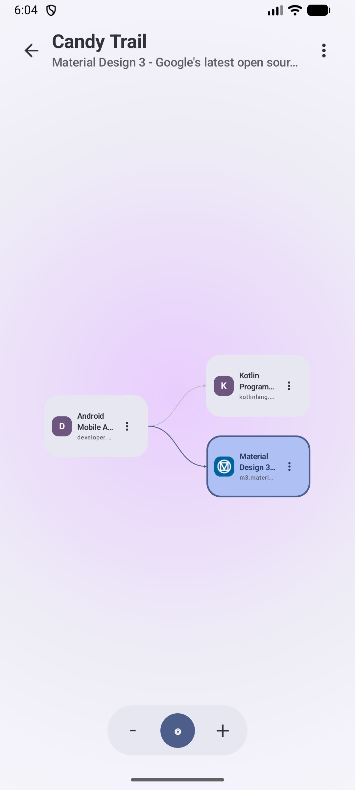
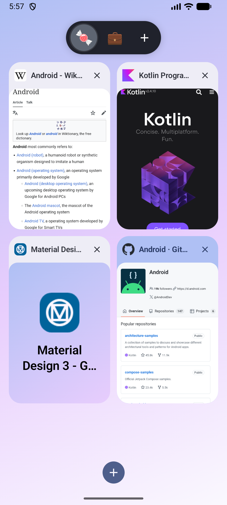
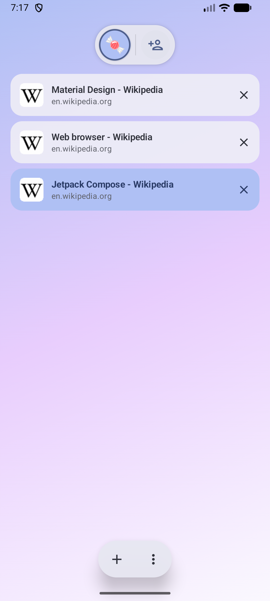

<p align="center">
  
</p>

<h1 align="center">Candy Browser</h1>

<p align="center">
  A gesture-first Android browser with Material 3 Expressive design, local privacy tools,
  and a tab system built for visual navigation.
</p>

<p align="center">
  <a href="https://github.com/sk2andy/candy-browser/releases/latest"></a>
  
  
  
  <a href="LICENSE"></a>
</p>

<p align="center">
  <a href="https://buymeacoffee.com/sk2andy"></a>
</p>

<p align="center">
  
  &nbsp;
  
  &nbsp;
  
</p>

## Why Candy?

- **Made for gestures.** Switch tabs from the address bar, swipe into the visual overview, and
  dismiss cards with spring motion and haptic feedback.
- **Private by design.** Filtering, history, favorites, profiles, and privacy telemetry stay local.
- **Feels at home on Android.** Dynamic color, edge-to-edge content, Predictive Back, Autofill,
  passkeys, downloads, sharing, printing, and default-browser integration.

## Features

### Browsing and gestures

- Floating bottom chrome over edge-to-edge WebView content
- Pull to refresh, direct URL navigation, QR scanning, and address autocomplete
- Google, DuckDuckGo, Bing, Brave, Ecosia, Startpage, and Qwant search
- Address commands with `>` for tab, profile, cache, cookie, and navigation actions
- Background tabs, downloads, sharing, printing, external apps, and assistant summaries

<p align="center">
  
</p>

### Tabs, profiles, and journeys

- Persistent tabs with saved page previews, favicons, pinning, reordering, and automatic cleanup
- Cover flow, compact grid, and preview-free list layouts
- Optional per-profile WebView storage isolation where the installed provider supports it
- Private tabs that keep their session and journey data in memory only
- **Candy Trails:** persistent branching navigation graphs with pan, zoom, direct navigation,
  and forkable paths
- **Site Capsules:** profile-bound home-screen shortcuts with configurable navigation boundaries
  and minimal browser chrome

<p align="center">
  
  &nbsp;
  
</p>

<p align="center">
  
  &nbsp;
  
  &nbsp;
  
</p>

### Local protection

- EasyList/EasyPrivacy hosts plus a pinned, safely representable uAssets subset
- Third-party-cookie blocking and cosmetic cookie-banner hiding
- **Privacy X-Ray:** live per-tab block counts, categories, domains, and exceptions
- **Filter Studio:** global or profile rules, import/export, and confirmed HTTPS subscriptions
- Safe Browsing, TLS failure handling, blocked unsafe schemes, and external-scheme allowlisting

## Download

Version **0.1** requires Android 14 (API 34) or newer.

[Download Candy Browser v0.1](https://github.com/sk2andy/candy-browser/releases/download/v0.1/CandyBrowser-v0.1-release.apk)

Android may ask you to allow installation from your browser or file manager. Releases outside
Google Play do not update automatically.

## Build from source

Requirements: Android SDK 35 and JDK 17. Point `JAVA_HOME` to your JDK 17 installation.

```bash
./gradlew testDebugUnitTest lintDebug assembleDebug
```

Debug APK: `app/build/outputs/apk/debug/app-debug.apk`

Release builds are minified with R8. Configure your own Android signing key before distributing a
release build; never commit a keystore or its credentials.

## Privacy and limitations

Candy uses Android System WebView as its browser engine. WebView does not expose Chromium's
extension API, so filtering uses local request interception and bounded cosmetic rules. WebSockets,
CNAME cloaking, some redirects, and content inside closed cross-origin or Shadow DOM contexts may
get through.

Privacy X-Ray includes only blocked requests that WebView can reliably attribute to one tab.
Service-worker requests are filtered but excluded from per-tab telemetry when no reliable tab ID
is available.

<details>
<summary><strong>Candy Rules and filter-source details</strong></summary>

Candy Rules v1 supports exact host block/allow rules, positive site-to-host pairs, HOSTS entries,
and origin-scoped standard CSS selectors. It deliberately rejects JavaScript, regular expressions,
redirects, response-header filters, scriptlets, and advanced cosmetic operators rather than
approximating them.

Imports are bounded and validated atomically. HTTPS subscriptions update only after a user-requested
fetch, show a diff, and require confirmation. Private-profile imports remain in memory.

EasyList, EasyPrivacy, and EasyList Cookie data are distributed under CC BY-SA 3.0 or later. The
uAssets-derived network subset is generated from a pinned revision of the official uBlock Origin Ads
source and distributed under GPL-3.0. Exact sources, revisions, transformations, and notices ship in
`app/src/main/assets/`.

</details>

## Languages

English, German, French, Portuguese, and Spanish.

## Licensing

Candy Browser source code is available under the [Mozilla Public License 2.0](LICENSE).
Third-party components and filter data retain their own licenses; bundled notices are available in
`app/src/main/assets/third_party_notices.txt` and inside the app.
