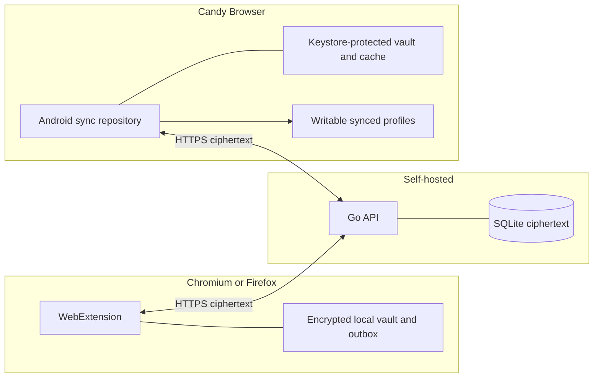

# Candy Sync

Candy Sync is a self-hosted, end-to-end encrypted tab synchronization system for Candy Browser,
Chromium, and Firefox. A Go/SQLite server stores opaque ciphertext; clients own every encryption key
and render each device as a writable synced profile.

## Documentation

| Need | Document |
| --- | --- |
| Deploy, configure, back up, and monitor the server | [`server.md`](server.md) |
| Build, load, configure, and test the extension | [`extension.md`](extension.md) |
| Android setup, profile behavior, security, and code ownership | [`app-integration.md`](app-integration.md) |
| Normative threat model and cryptographic contract | [`../../sync/SECURITY.md`](../../sync/SECURITY.md) |
| REST, schemas, fixtures, and shared icon catalog | [`../../sync/protocol/README.md`](../../sync/protocol/README.md) |

## Implemented scope

| Capability | Status |
| --- | --- |
| Single-workspace Go/SQLite server and Docker Compose | Implemented |
| Chromium MV3 and Firefox WebExtension builds | Implemented |
| Android client with Keystore-protected local secrets | Implemented |
| First-device setup and later-device passphrase recovery | Implemented |
| Writable device profiles: open, navigate, pin, reorder, close | Implemented |
| Durable offline outbox, cursor pull, acknowledgement, and CAS retry | Implemented |
| Shared freely selectable 54-icon catalog | Implemented |
| Private/internal/local-file exclusion | Implemented |
| Bookmark and tab-group merge | Not implemented |
| Candy-hosted service | Not part of the self-hosted v1 scope |
| iOS client | Deferred |

## System boundary



The server sees authentication metadata, target IDs, revisions, cursors, and ciphertext. It never
receives the E2EE passphrase, workspace key, private key, device name, icon descriptor, URL, or title
in plaintext.

## Identity and immutable passphrase

| Value | Purpose | Server access |
| --- | --- | --- |
| Username and server password | Bootstrap and enrollment authentication | Yes |
| Device bearer token | Normal authenticated sync | Hash only after issuance |
| E2EE passphrase | Unlock the shared recovery envelope | Never |
| Workspace key | Encrypt shared device data | Encrypted recovery envelope only |
| Per-device P-256 private key | Local device identity | Never |

The E2EE passphrase is immutable in protocol v1. It cannot be changed or recovered. Do not put it in
Docker Compose, `.env`, server secrets, logs, or support messages.

## Repository layout

| Path | Responsibility |
| --- | --- |
| `sync/server/` | Go API, SQLite store, migrations, container, server tests |
| `sync/extension/` | Shared Chromium/Firefox client, Options Page, tests |
| `sync/protocol/` | OpenAPI, schemas, fixtures, and shared device icons |
| `sync/scripts/` | Clean-room Docker verification and real two-device E2E |
| `app/src/main/.../sync/` | Android protocol, cryptography, and models |
| `app/src/main/.../data/sync/` | Android protected stores, transport, and repository |

Run the clean-room server/extension gate from the repository root:

```sh
./sync/scripts/test-all.sh
```

It creates all credentials, ports, databases, and test devices automatically.
