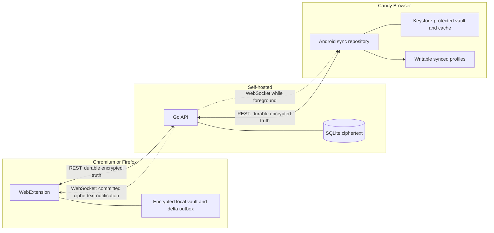

# Candy Sync

Candy Sync is a self-hosted, end-to-end encrypted tab synchronization system for Candy Browser,
Chromium, and Firefox. A Go/SQLite server stores opaque ciphertext; clients own every encryption key
and render remote devices as writable synced profiles. Protocol v1 provides compatible encrypted
snapshots. Protocol v2 adds encrypted, workspace-scoped tab mutations with durable REST recovery and
WebSocket delivery. On Android, the current device binds to an existing local profile instead of
creating a duplicate self profile.

## Documentation

| Need | Document |
| --- | --- |
| Deploy, configure, back up, and monitor the server | [`server.md`](server.md) |
| Build, load, configure, and test the extension | [`extension.md`](extension.md) |
| Android setup, profile behavior, security, and code ownership | [`app-integration.md`](app-integration.md) |
| Normative threat model and cryptographic contract | [`../../sync/SECURITY.md`](../../sync/SECURITY.md) |
| REST, schemas, fixtures, and shared icon catalog | [`../../sync/protocol/README.md`](../../sync/protocol/README.md) |

## Implemented scope

| Capability | Status |
| --- | --- |
| Go/SQLite server and Docker Compose, currently one configured account/workspace | Implemented |
| Chromium MV3 and Firefox WebExtension builds | Implemented |
| Android client with Keystore-protected local secrets and local-profile binding | Implemented |
| First-device setup and later-device passphrase recovery | Implemented |
| Writable device profiles: open, navigate, pin, reorder, close | Implemented |
| Durable offline outbox, cursor pull, acknowledgement, and CAS retry | Implemented |
| Protocol v2 encrypted tab deltas and authenticated realtime delivery | Implemented |
| Shared freely selectable 54-icon catalog | Implemented |
| Private/internal/local-file exclusion | Implemented |
| Bookmark and tab-group merge | Not implemented |
| Candy-hosted service | Not part of the self-hosted scope |
| iOS client | Deferred |

## System boundary



WebSocket delivery accelerates updates; it is never authoritative. Every client persists its v2
cursor and recovers gaps, disconnects, slow-consumer drops, and background wake-ups through ordered
`GET /v2/sync/pull`. V1 and v2 cursors share the server epoch but use independent sequence spaces.

The server sees authentication metadata, target IDs, revisions, cursors, and ciphertext. It never
receives the E2EE passphrase, workspace key, private key, device name, icon descriptor, URL, or title
in plaintext.

## Identity and immutable passphrase

| Value | Purpose | Server access |
| --- | --- | --- |
| Username and server password | Bootstrap and enrollment authentication | Yes |
| Device bearer token | Normal authenticated sync | Hash only after issuance |
| E2EE passphrase | Unlock the shared recovery envelope | Never |
| Workspace key | Encrypt shared device data | Encrypted recovery envelope only |
| Per-device P-256 private key | Local device identity | Never |

The E2EE passphrase is immutable for the workspace. Neither protocol v1 nor v2 can change or recover
it. Do not put it in Docker Compose, `.env`, server secrets, logs, or support messages.

## Protocol transition and tenancy

New clients prefer v2 only when discovery advertises protocol 2, `tab-mutations-v2`, and
`realtime`. The first committed v2 delta atomically raises that workspace's protocol floor to 2.
Later v1 tab writes then fail with `409 protocol_upgrade_required`; v1 reads remain available for
migration and recovery. Before promotion, accepted v1 writes advance the v2 revision baseline, so
mixed clients cannot fork a target profile.

The v2 storage and authentication model is tenant-ready: bearer identity carries account,
workspace, and device, and every v2 query is workspace-scoped. Today's self-hosted deployment still
configures exactly one account and default workspace through environment credentials. Account
provisioning, invitations, roles beyond stored membership, and a multi-user admin surface are not
implemented.

## Repository layout

| Path | Responsibility |
| --- | --- |
| `sync/server/` | Go API, SQLite store, migrations, container, server tests |
| `sync/extension/` | Shared Chromium/Firefox client, Options Page, tests |
| `sync/protocol/` | OpenAPI, schemas, fixtures, and shared device icons |
| `sync/scripts/` | Clean-room Docker verification and real two-device E2E |
| `app/src/main/.../sync/` | Android protocol, cryptography, and models |
| `app/src/main/.../data/sync/` | Android protected stores, transport, and repository |

Run the clean-room server/extension gate from the repository root:

```sh
./sync/scripts/test-all.sh
```

It creates all credentials, ports, databases, and test devices automatically.
