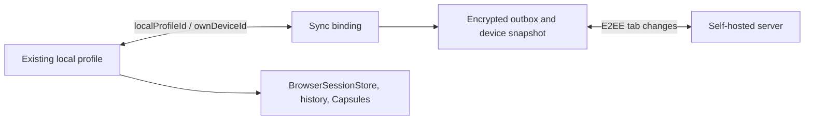

# Candy Browser Android sync integration

Candy Browser implements Candy Sync through profile bindings and writable device profiles. The
current Android device binds to one existing local profile. That profile keeps its own icon and
normal local behavior, gains a sync badge, and is not duplicated in the profile switcher. Every
other active device appears beside local profiles with its encrypted name, freely selected shared
icon, accent, and a local sync badge.

## Current-device profile binding

Setup defaults to the active local profile and lets the user select any existing local profile. The
encrypted Android device identity is then associated locally with that profile ID:



The binding is local metadata. The server never receives the Candy profile ID. The bound profile
remains a local profile: history, Candy Trails, Site Capsules, WebView isolation, snoozing, and
normal session persistence keep their existing owners. Only its non-private HTTP(S) tab projection
is synchronized.

During first binding, Android assigns stable sync IDs to eligible existing tabs and publishes them.
Remote tabs already present for the device are merged into the same local profile. Private tabs and
untracked blank, internal, or local-file tabs are preserved locally. Once a synchronized tab has
been acknowledged, a later remote close removes it locally. This distinguishes initial migration
from a real remote deletion.

The binding cannot point at an incognito context, and a profile cannot be deleted while actively
bound. Legacy Android sync settings without a profile ID migrate to the active local profile.

## User model

Selecting a synced profile opens that device's tab snapshot inside the normal Android tab UI. The
profile is not read-only: Android can open, navigate, pin, reorder, and close its tabs. The desktop
extension applies those changes when the target browser is available.

```mermaid
flowchart LR
    A[Android synced profile] -->|Open / navigate / pin / reorder / close| R[Encrypted mutation queue]
    R -->|CAS encrypted snapshot| S[Self-hosted server]
    S -->|Pull target changes| E[Chromium or Firefox extension]
    E -->|Apply safe HTTP(S) tab diff| D[Desktop browser tabs]
```

The server records the authenticated writer separately from the target device. An Android device
may therefore update a desktop device's profile without impersonating it.

## Runtime ownership boundary

Synced profiles use a `BrowserProfile`-compatible runtime projection so existing tab and WebView
interaction remains native. The projection is deliberately excluded from local ownership stores.

| Data | Local profile | Synced profile |
| --- | --- | --- |
| Tab/WebView interaction while running | Yes | Yes |
| `BrowserSessionStore` tabs and profile | Yes, including stable sync IDs for a bound profile | No |
| Incognito tabs | Yes | Never |
| Candy Trails, snooze, local history, Recall | Yes | Not persisted for synced tabs |
| Site Capsules and isolated WebView storage | Yes | Not owned by synced profiles |
| Encrypted sync cache/outbox | No | Yes |

`BrowserProfile.syncedDeviceId` identifies a runtime projection. `BrowserTab.syncCandyId` is the
stable cross-client tab identity; the Android runtime tab ID remains an implementation detail.

An empty `about:blank` tab is kept locally until its first valid HTTP(S) navigation. It then becomes
an encrypted `Open` mutation. `file:`, browser-internal, malformed, and private URLs never enter the
sync payload.

## Supported mutations

| Android action | Durable logical mutation | Target result |
| --- | --- | --- |
| Open a URL | `Open` | Create or adopt the stable `candyId` |
| Navigate, including SPA history updates | `Navigate` | Update URL and bounded title |
| Pin or unpin | `SetPinned` | Update pinned state |
| Drag to reorder | `Reorder` | Reconcile the ordered stable IDs |
| Close | `Close` | Remove the matching desktop tab |

Navigation events are debounced before entering the serialized repository. The repository folds
pending mutations into its observable state immediately, persists them in a Keystore-protected
cache, and retries them after reconnecting.

## Conflicts and delivery

Every target profile has a monotonically increasing revision. Android encrypts the proposed target
snapshot and sends a compare-and-swap update. On `409 snapshot_conflict`, it pulls the latest target,
replays the logical mutation by stable ID, and creates a new attempt.

A prepared delivery attempt stores its exact change ID, base revision, nonce, and ciphertext before
network I/O. A timeout or process restart reuses those exact bytes. This prevents a lost response
from producing different ciphertext under one idempotency key. A confirmed CAS conflict retires the
attempt before a fresh encrypted attempt is created.

## Shared device icons

[`device-icons-v1.json`](../../sync/protocol/device-icons-v1.json) is the canonical catalog used by
Android's local-profile picker, Android's sync settings, and both extension builds. Its 54 emoji
icons therefore cannot drift between clients. Users freely select an icon; the encrypted descriptor
stores only:

```json
{
  "schemaVersion": 1,
  "catalogId": "computer",
  "accentHue": 312
}
```

The Android build copies the versioned JSON into generated assets. Unknown catalog IDs fail closed.
The small sync badge is local UI state and is not part of user-controlled encrypted metadata.

## Setup and secrets

The Sync settings page requests:

- the exact self-hosted endpoint;
- server username and one-time enrollment password;
- the existing local profile represented by this Android device;
- this device's encrypted display name, icon, and palette-picked accent color;
- the E2EE passphrase and confirmation.

The server password and E2EE passphrase must differ. Neither input is saved. The passphrase never
leaves the device, cannot be changed or recovered in protocol v1, and is needed to enroll future
devices. Losing it can make the workspace unrecoverable. Each secret field has an explicit
show/hide control, and the settings page remains scrollable above the on-screen keyboard.

Android generates its own P-256 device key locally. The workspace key, bearer token, and private key
are stored in an AES-GCM vault protected by a non-exportable Android Keystore AES-256 key. The
decrypted cache is likewise protected at rest. Server responses are parsed with exact keys, bounded
sizes, authenticated metadata, and strict HTTP(S) URL policy.

Remote HTTP endpoints are stored only as provisional setup endpoints. Android performs
unauthenticated discovery and sends no Basic credential or bearer token until the server reports
`allowHttp: true`. That report requires `CANDY_SYNC_ALLOW_HTTP=true` server-side. It is a deliberate
cleartext opt-in, not transport security; HTTPS remains the recommended deployment.

## Refresh behavior

The controller refreshes on foreground start and every 15 seconds while the app is active. Local
mutations push immediately; offline writes remain durable and replay after a later refresh. The
settings page also offers **Sync now**. The current implementation does not keep a permanent socket
or wake a closed app continuously.

## Code map

| Path | Responsibility |
| --- | --- |
| `sync/SyncCrypto.kt` | P-256, HKDF, AES-GCM, recovery-envelope primitives |
| `sync/SyncProtocolCodec.kt` | Strict protocol JSON and authenticated metadata |
| `sync/SyncTabRules.kt` | Deterministic mutation and URL rules |
| `data/sync/CandySyncRepository.kt` | Enrollment, pull, CAS, outbox, retry, observable state |
| `data/sync/AndroidSyncStores.kt` | Keystore-backed vault and encrypted cache |
| `browser/SyncedProfileRuntimeRules.kt` | Runtime profile/tab projection and reconciliation |
| `ui/SyncSettingsPage.kt` | Setup, immutable-passphrase warning, status, and device list |

## Verification

```sh
./gradlew testFullDebugUnitTest testFossDebugUnitTest
./gradlew lintFullDebug lintFossDebug assembleFullDebug assembleFossDebug
./sync/scripts/test-all.sh
```

Android security instrumentation requires a dedicated API 34+ emulator with an explicit
`ANDROID_SERIAL`. The repository suite covers known-answer crypto, tampering, wrong passphrases,
strict parsing, Keystore restart behavior, offline retry, lost-response idempotency, and CAS replay.
`./sync/scripts/test-android.sh` provisions its own disposable API 35 AVD, sets the serial explicitly,
runs the sync unit/UI/security suite, and deletes the AVD afterward.
