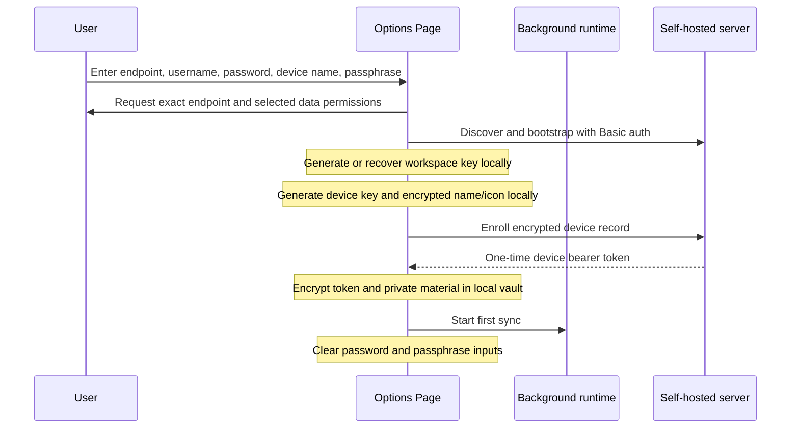

# Candy Sync browser extension

The Candy Sync WebExtension adds encrypted desktop-tab export to Chromium and Firefox without a
toolbar popup. Configuration and status live on a full Options Page opened from the browser's normal
extension settings. Background events keep sync current and a periodic alarm retries missed work.

## Current scope

| Capability | Status |
| --- | --- |
| Self-hosted endpoint, username, one-time password, device name | Implemented |
| Locally generated workspace key and per-device P-256 identity | Implemented |
| Immutable passphrase recovery and encrypted local vault | Implemented |
| Encrypted device name and versioned device icon descriptor | Implemented |
| HTTP(S), non-private tab capture and encrypted upload | Implemented |
| Chromium Manifest V3 service worker | Implemented |
| Firefox non-persistent background page | Implemented |
| Pulling and applying changes targeting this desktop device | Implemented |
| Cross-device open, navigate, pin, reorder, and close | Implemented |
| Freely selectable shared Android-compatible profile icon | Implemented |
| Bookmark merge and direct pairing | Not implemented |

Selecting bookmarks currently manages the optional browser permission but does not enable bookmark
merge. Tab-group assignments are included in tab snapshots when group sync is selected.

## Build and load

From `sync/extension/` with Node.js 20.19 or newer:

```sh
npm ci
npm run verify
```

Build artifacts appear in `dist/chromium/` and `dist/firefox/`.

| Browser | Development loading path |
| --- | --- |
| Chromium | `chrome://extensions` → Developer mode → Load unpacked → `dist/chromium` |
| Firefox | `about:debugging#/runtime/this-firefox` → Load Temporary Add-on → `dist/firefox/manifest.json` |

Open the extension's Options Page from the browser's extension-management page. There is no toolbar
action and no popup.

## Setup flow



For the first device, the extension creates the workspace key and immutable recovery envelope. A
later device downloads that envelope and unlocks it locally using the same passphrase. It then
creates its own independent device key and encrypted name/icon. No passphrase is sent to the server.

The server password and E2EE passphrase must differ. The password is used only during enrollment and
is not persisted. The passphrase is never persisted and must be entered again after browser restart
to unlock sync.

## Device icon

The Options Page loads the versioned
[`device-icons-v1.json`](../../sync/protocol/device-icons-v1.json) catalog and lets the user freely
choose among the same 54 emoji icons used by Android profiles. The descriptor contains only the
catalog ID and an accent hue. It is encrypted with a device-presentation key derived from the
workspace key. Both name and icon envelopes are authenticated against the exact public-key
fingerprint, so swapping presentation data between device records fails decryption.

Unknown catalog IDs fail closed. The sync badge shown by Candy Browser is separate local UI state
and cannot be spoofed by the descriptor.

## Runtime behavior

The background runtime reacts to tab creation, removal, movement, updates, browser startup, and
permission changes. Multiple events coalesce into a serialized sync operation. A five-minute alarm
is the recovery path for suspended background contexts or missed events.

Before upload, capture rules:

- reject private/incognito tabs;
- retain only `http:` and `https:` URLs;
- reject malformed and internal browser URLs;
- truncate titles to the protocol limit;
- order tabs deterministically;
- remove group assignments when group sync is disabled.

The extension writes an encrypted change to a durable local outbox before upload. A retry reuses its
change ID, nonce, and ciphertext. The server can therefore accept repeated delivery idempotently
without risking AES-GCM nonce reuse from re-encryption.

Before uploading its own browser state, the extension pulls and applies pending changes targeting
its device profile. Stable `candyId` values are persisted in `storage.local`, so normal navigation
does not create a new logical tab. Reconciliation creates, updates, pins, moves, and removes only
eligible HTTP(S) tabs; incognito, internal, local-file, and unmanaged tabs are preserved.

## Permissions

| Permission | Lifecycle |
| --- | --- |
| `storage`, `alarms` | Baseline extension permissions |
| `tabs` | Requested when tab sync is selected |
| `tabGroups` | Requested when group sync is selected and supported |
| `bookmarks` | Requested when bookmark sync is selected; merge is future work |
| Endpoint host access | Requested for the exact configured origin during explicit setup |

There are no content scripts and no web-accessible resources. Permission add/remove events update
effective sync state.

## Local storage

| Storage area | Contents |
| --- | --- |
| `storage.local` | Non-secret settings, encrypted vault, encrypted outbox, redacted status |
| `storage.session` | Unlocked vault secrets for the current browser session |
| `storage.sync` | Never used |

WebExtensions do not expose one portable OS keychain API across Chromium and Firefox. The local
vault protects a locked browser profile, not a running unlocked profile against malware, debugging,
or a compromised extension update.

## Status model

The Options Page reports `unconfigured`, `locked`, `ready`, `syncing`, `current`, `offline`,
`auth-error`, `crypto-error`, `permission-required`, or `incompatible`. Status text is deliberately
redacted and must not include secret or browsing plaintext.

## Verification

```sh
npm run typecheck
npm test
npm run build:chromium
npm run build:firefox
npm run test:build
npm run lint:manifests
npm run verify:reproducible
```

Use `./sync/scripts/test-all.sh` from the repository root for the complete Docker-isolated server,
extension, protocol, reproducibility, audit, and plaintext-canary gate.

See [`../../sync/extension/README.md`](../../sync/extension/README.md) for contributor commands and
[`../../sync/extension/SECURITY.md`](../../sync/extension/SECURITY.md) for client-side invariants.
