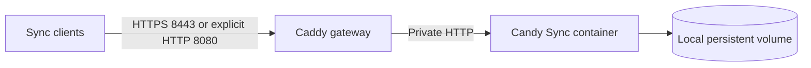

# Candy Sync server

The self-hosted server is a single-workspace Go service backed by SQLite. It authenticates clients,
assigns monotonic revisions and opaque cursors, and stores encrypted device metadata and snapshots.
It is intentionally not a decryption endpoint.

## Quick start

From `sync/server/`:

```sh
cp .env.example .env
```

Set a unique username and a random server-authentication password of at least 16 bytes, then start
the service:

```sh
docker compose up --build -d
docker compose ps
```

Compose includes a Caddy gateway with two independent ports:

| Endpoint | Default | Use |
| --- | --- | --- |
| HTTPS | `https://localhost:8443` | Recommended client endpoint |
| HTTP | `http://localhost:8080` | Explicit local-development fallback |

Caddy issues and renews the HTTPS leaf through its persistent local CA. After the first start,
export only the public root certificate with `./scripts/export-local-ca.sh` and trust it on each
development client. A client that does not trust the root must reject the connection. Never disable
TLS verification in Candy Sync, and never export the CA private key from the Docker volume.

| Client | Local CA setup |
| --- | --- |
| macOS / Arc | Import `.local-tls/root.crt` into the login keychain and set SSL trust in Keychain Access |
| Android | Install the root as a user CA and run the opt-in `userCaDebug` or `userCaRelease` build |
| Standard Candy Browser build | Use a publicly trusted certificate; user CAs remain intentionally excluded |

Trusting a CA lets it authenticate TLS endpoints. Protect the persistent `candy-sync-tls-data`
volume that contains the CA signing key, and remove the client-side trust when this local deployment
is retired.

For LAN access, set `CANDY_SYNC_TLS_HOST` to the exact IP address or DNS name clients use,
`CANDY_SYNC_PUBLIC_URL` to `https://<host>:<TLS port>`, and publish through a reachable bind address.
If the host changes, Caddy issues a matching leaf while retaining the same root CA.

Trusted-LAN HTTP requires three explicit values: an `http://` public URL,
`CANDY_SYNC_ALLOW_HTTP=true`, and a reachable Compose publish address such as
`CANDY_SYNC_BIND_ADDRESS=0.0.0.0`. Clients perform unauthenticated discovery first and refuse to send
Basic credentials or bearer tokens unless the server advertises the enabled flag. This prevents
accidental cleartext use, but it cannot protect against interception; HTTP exposes credentials,
tokens, identifiers, timing, and ciphertext to the network.

Do not add the E2EE passphrase to `.env`. The server rejects `CANDY_SYNC_PASSPHRASE` at startup.
The passphrase belongs only in a client setup or unlock screen.

## Configuration

| Variable | Required | Default | Purpose |
| --- | ---: | --- | --- |
| `CANDY_SYNC_USERNAME` | Yes | — | Bootstrap and enrollment username |
| `CANDY_SYNC_PASSWORD` | Yes | — | Server-auth password; at least 16 bytes |
| `CANDY_SYNC_PUBLIC_URL` | Remote use | — | Public HTTPS origin, or HTTP when explicitly allowed |
| `CANDY_SYNC_ALLOW_HTTP` | No | `false` | Explicitly permit and advertise non-loopback HTTP |
| `CANDY_SYNC_BIND_ADDRESS` | No | `127.0.0.1` | Host address on which Compose publishes the port |
| `CANDY_SYNC_PORT` | No | `8080` | Published HTTP fallback port |
| `CANDY_SYNC_TLS_HOST` | No | `localhost` | Exact certificate DNS name or IP address |
| `CANDY_SYNC_TLS_PORT` | No | `8443` | Published HTTPS port |
| `CANDY_SYNC_LISTEN_ADDR` | No | `:8080` | Container listen address |
| `CANDY_SYNC_DB_PATH` | No | `/data/candy-sync.sqlite3` | SQLite file on local storage |
| `CANDY_SYNC_TOKEN_TTL` | No | `0` | Device-token lifetime; `0` lasts until revocation |
| `CANDY_SYNC_MAX_BODY_BYTES` | No | `1048576` | Request-body ceiling |
| `CANDY_SYNC_MAX_BATCH` | No | `250` | Pull/push batch ceiling |
| `CANDY_SYNC_LOG_LEVEL` | No | `info` | `debug`, `info`, `warn`, or `error` |
| `CANDY_SYNC_CLIENT_IP_HEADER` | No | Empty in binary | Trusted proxy header for Basic-auth rate limits |

The supplied Compose file publishes only Caddy. Caddy overwrites `X-Forwarded-For` before forwarding
to the private Go container. A different production reverse proxy must preserve this trust boundary.
Leave the variable empty when the service is not behind a trusted proxy.

Changing the configured username or password invalidates existing device tokens. Clients must
enroll again with the same immutable E2EE passphrase to recover the existing workspace key.

## Deployment topology



Keep these invariants:

- expose only the reverse proxy publicly;
- keep SQLite on a local filesystem, not NFS;
- run one server replica per SQLite database;
- persist `/data` on a durable volume;
- terminate TLS with a valid public certificate or the documented local CA;
- never inject the E2EE passphrase into server-side configuration.

When intentionally using trusted-LAN HTTP, the first and fifth invariants are relaxed only for that
isolated network. E2EE still protects synced payload plaintext, but it does not protect server
credentials, device tokens, or metadata carried by HTTP.

The Go runtime image is non-root, read-only apart from `/data`, drops Linux capabilities, and
includes an internal health check. The Caddy container is read-only apart from its persistent
certificate/configuration volumes and also drops Linux capabilities.

## API responsibilities

| Surface | Server responsibility | Client responsibility |
| --- | --- | --- |
| Discovery | Publish protocol versions and limits | Reject incompatible or unsafe values |
| Bootstrap | Return workspace state and immutable recovery ciphertext | Derive the recovery key locally |
| Enrollment | Validate public identity and encrypted presentation data; issue token once | Generate keys and encrypt name/icon locally |
| Device list | Return public identity plus encrypted presentation fields | Authenticate and decrypt locally |
| Push | Atomically CAS-update one target device and retain authenticated writer identity | Reuse the same ciphertext on delivery retry |
| Pull/snapshot | Return ordered encrypted records and cursors | Authenticate before parsing plaintext |
| Revocation | Deny future token use | Treat already copied plaintext as unrecoverable |

The exact contract is [`../../sync/protocol/openapi.yaml`](../../sync/protocol/openapi.yaml). API
errors use `application/problem+json`; revisions are decimal strings; cursors are opaque.

## Storage, backup, and restore

SQLite uses WAL mode and `synchronous=FULL`. A plain copy of the main database while the process is
running can omit committed WAL data. Either stop the container before copying the database or use a
SQLite-consistent backup tool that includes WAL state.

A restore can roll the server behind cursors already held by clients. Protocol v1 has no finished
administrative restore command for rotating the server epoch. Until that exists, restore testing
must use a fresh workspace and full encrypted resynchronization rather than silently serving an old
database as current.

The database is sensitive even though payloads are encrypted: it exposes traffic metadata and the
recovery envelope enables offline passphrase guessing. Protect backups, restrict filesystem access,
and use a high-entropy E2EE passphrase.

## Operations

| Check | Endpoint or command | Expected result |
| --- | --- | --- |
| Process health | `GET /healthz` | Process is serving HTTP |
| Storage readiness | `GET /readyz` | Database is writable and initialized |
| Container state | `docker compose ps` | Service healthy |
| Recent logs | `docker compose logs --tail=100 candy-sync` | No secrets or sync plaintext |

Logs may contain routing and timing metadata, but must never contain passwords, bearer tokens,
passphrases, workspace keys, private keys, URLs, titles, device names, icon descriptors, or
ciphertext.

## Verification

Server-only checks from `sync/server/`:

```sh
go test -count=1 ./...
go test -race -count=1 ./...
go vet ./...
./scripts/test.sh
```

The repository gate `./sync/scripts/test-all.sh` also starts a disposable server, drives real
extension cryptography through it, and scans its SQLite database and logs for plaintext canaries.

See [`../../sync/server/README.md`](../../sync/server/README.md) for contributor-level API details
and [`../../sync/SECURITY.md`](../../sync/SECURITY.md) for the normative threat model.
