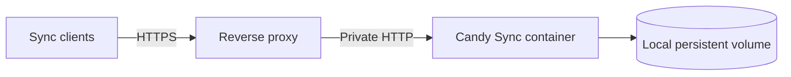

# Candy Sync server

The self-hosted server is a single-workspace Go service backed by SQLite. It authenticates clients,
assigns monotonic revisions and opaque cursors, and stores encrypted device metadata and snapshots.
It is intentionally not a decryption endpoint.

## Quick start

From `sync/server/`:

```sh
cp .env.example .env
```

Set a unique username and a random server-authentication password of at least 16 bytes, then start
the service:

```sh
docker compose up --build -d
docker compose ps
```

The default development endpoint is `http://localhost:8080`. The Compose port binds to loopback.
For access from another device, place the service behind a correctly configured HTTPS reverse proxy
and set `CANDY_SYNC_PUBLIC_URL` to its public HTTPS origin.

Do not add the E2EE passphrase to `.env`. The server rejects `CANDY_SYNC_PASSPHRASE` at startup.
The passphrase belongs only in a client setup or unlock screen.

## Configuration

| Variable | Required | Default | Purpose |
| --- | ---: | --- | --- |
| `CANDY_SYNC_USERNAME` | Yes | — | Bootstrap and enrollment username |
| `CANDY_SYNC_PASSWORD` | Yes | — | Server-auth password; at least 16 bytes |
| `CANDY_SYNC_PUBLIC_URL` | Remote use | — | Public HTTPS origin, or loopback HTTP for development |
| `CANDY_SYNC_LISTEN_ADDR` | No | `:8080` | Container listen address |
| `CANDY_SYNC_DB_PATH` | No | `/data/candy-sync.sqlite3` | SQLite file on local storage |
| `CANDY_SYNC_TOKEN_TTL` | No | `0` | Device-token lifetime; `0` lasts until revocation |
| `CANDY_SYNC_MAX_BODY_BYTES` | No | `1048576` | Request-body ceiling |
| `CANDY_SYNC_MAX_BATCH` | No | `250` | Pull/push batch ceiling |
| `CANDY_SYNC_LOG_LEVEL` | No | `info` | `debug`, `info`, `warn`, or `error` |
| `CANDY_SYNC_CLIENT_IP_HEADER` | No | Empty in binary | Trusted proxy header for Basic-auth rate limits |

The supplied Compose file sets `X-Forwarded-For`. A production reverse proxy must overwrite this
header instead of accepting or appending a client-provided value. Leave the variable empty when the
service is not behind a trusted proxy.

Changing the configured username or password invalidates existing device tokens. Clients must
enroll again with the same immutable E2EE passphrase to recover the existing workspace key.

## Deployment topology



Keep these invariants:

- expose only the reverse proxy publicly;
- keep SQLite on a local filesystem, not NFS;
- run one server replica per SQLite database;
- persist `/data` on a durable volume;
- terminate TLS with a valid certificate;
- never inject the E2EE passphrase into server-side configuration.

The runtime image is non-root, read-only apart from `/data`, drops Linux capabilities, and includes
an internal health check.

## API responsibilities

| Surface | Server responsibility | Client responsibility |
| --- | --- | --- |
| Discovery | Publish protocol versions and limits | Reject incompatible or unsafe values |
| Bootstrap | Return workspace state and immutable recovery ciphertext | Derive the recovery key locally |
| Enrollment | Validate public identity and encrypted presentation data; issue token once | Generate keys and encrypt name/icon locally |
| Device list | Return public identity plus encrypted presentation fields | Authenticate and decrypt locally |
| Push | Atomically CAS-update one target device and retain authenticated writer identity | Reuse the same ciphertext on delivery retry |
| Pull/snapshot | Return ordered encrypted records and cursors | Authenticate before parsing plaintext |
| Revocation | Deny future token use | Treat already copied plaintext as unrecoverable |

The exact contract is [`../../sync/protocol/openapi.yaml`](../../sync/protocol/openapi.yaml). API
errors use `application/problem+json`; revisions are decimal strings; cursors are opaque.

## Storage, backup, and restore

SQLite uses WAL mode and `synchronous=FULL`. A plain copy of the main database while the process is
running can omit committed WAL data. Either stop the container before copying the database or use a
SQLite-consistent backup tool that includes WAL state.

A restore can roll the server behind cursors already held by clients. Protocol v1 has no finished
administrative restore command for rotating the server epoch. Until that exists, restore testing
must use a fresh workspace and full encrypted resynchronization rather than silently serving an old
database as current.

The database is sensitive even though payloads are encrypted: it exposes traffic metadata and the
recovery envelope enables offline passphrase guessing. Protect backups, restrict filesystem access,
and use a high-entropy E2EE passphrase.

## Operations

| Check | Endpoint or command | Expected result |
| --- | --- | --- |
| Process health | `GET /healthz` | Process is serving HTTP |
| Storage readiness | `GET /readyz` | Database is writable and initialized |
| Container state | `docker compose ps` | Service healthy |
| Recent logs | `docker compose logs --tail=100 candy-sync` | No secrets or sync plaintext |

Logs may contain routing and timing metadata, but must never contain passwords, bearer tokens,
passphrases, workspace keys, private keys, URLs, titles, device names, icon descriptors, or
ciphertext.

## Verification

Server-only checks from `sync/server/`:

```sh
go test -count=1 ./...
go test -race -count=1 ./...
go vet ./...
./scripts/test.sh
```

The repository gate `./sync/scripts/test-all.sh` also starts a disposable server, drives real
extension cryptography through it, and scans its SQLite database and logs for plaintext canaries.

See [`../../sync/server/README.md`](../../sync/server/README.md) for contributor-level API details
and [`../../sync/SECURITY.md`](../../sync/SECURITY.md) for the normative threat model.
