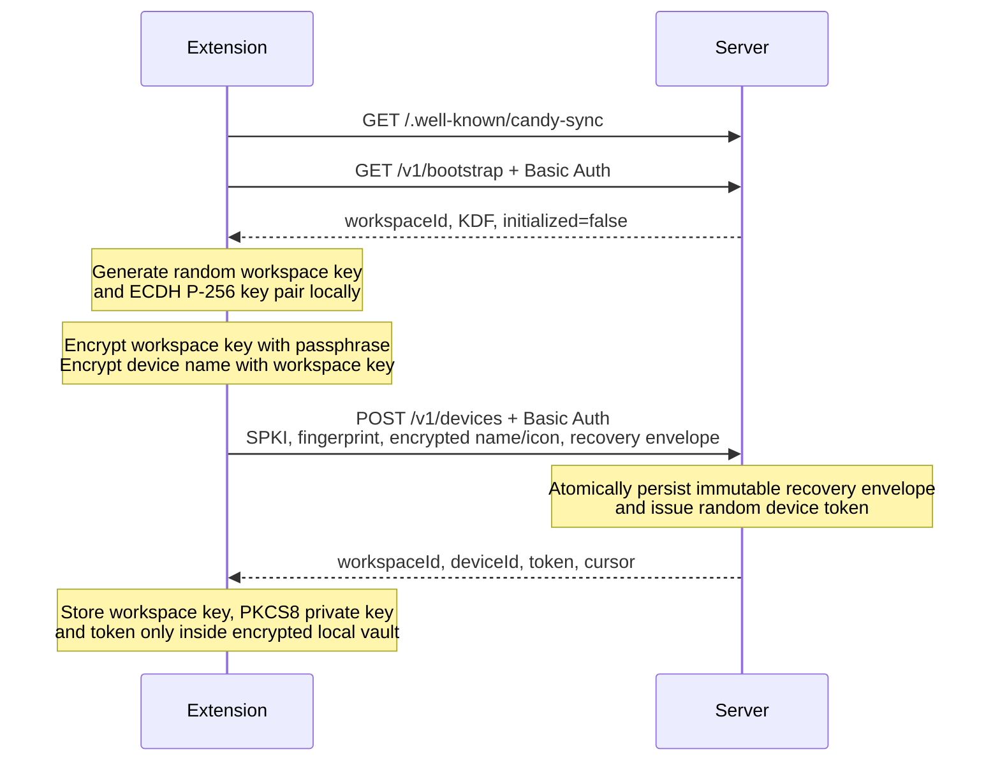

# Candy Sync security contract

This document is normative for implemented Candy Sync protocols v1 and v2 and
crypto version 1. Protocol v1 preserves encrypted snapshot compatibility;
protocol v2 adds encrypted tab mutations, workspace scoping, durable REST
recovery, and authenticated WebSocket delivery. [`protocol/openapi.yaml`](protocol/openapi.yaml)
and the JSON Schemas define exact wire shapes. Clients and server must fail
closed when these contracts disagree.

## Implemented scope

| Capability | Status |
| --- | --- |
| One configured self-hosted account and default workspace | Implemented |
| First Chromium/Firefox device enrollment | Implemented |
| Encrypted device name | Implemented |
| Encrypted target-device tab profiles with authenticated writers | Implemented |
| Push, pull, acknowledgement and full encrypted snapshot | Implemented server-side |
| Device list and token revocation | Implemented server-side |
| Additional device via passphrase recovery | Implemented |
| Encrypted stable per-device icon descriptor | Implemented |
| Protocol v2 encrypted tab mutations | Implemented |
| Workspace-scoped v2 cursors, revisions, and idempotency | Implemented |
| Single-use realtime tickets and committed-envelope WebSocket fan-out | Implemented |
| REST gap recovery and protocol-floor promotion | Implemented |
| Account/workspace storage boundary | Implemented; current deployment provisions one account/workspace |
| P-256 workspace-key envelope for another device | **Not implemented** |
| Key rotation after revocation | **Not implemented** |
| Ed25519 signatures, X25519 or HPKE | **Not part of implemented v1** |

An additional device downloads the immutable recovery envelope, unlocks the
workspace key locally with the same passphrase, creates its own P-256 identity,
and enrolls without replacing recovery state. Direct device-to-device pairing
and P-256 key envelopes remain later protocol work.

## Secret boundary

| Value | Server may possess | Client may possess | Persistent client location |
| --- | --- | --- | --- |
| Username | Yes | Yes | Non-secret settings |
| Server-auth password | Yes | During Basic-auth requests | Never after enrollment |
| E2EE passphrase | **Never** | During setup and unlock | Never |
| Workspace key | AES-GCM recovery ciphertext only | While unlocked | Encrypted local vault |
| P-256 private key | Never | While unlocked | PKCS8 bytes inside encrypted local vault |
| P-256 SPKI public key and SHA-256 fingerprint | Yes | Yes | Public device record |
| Device name and icon descriptor | Ciphertext only | Yes, while rendered | Encrypted device record |
| Device bearer token | Hash only | While unlocked | Encrypted local vault |

Username and password authenticate server access. They do not encrypt sync data.
E2EE passphrase protects workspace key and local vault. Auth password and E2EE
passphrase must be different.

### Server environment passphrase is forbidden

Server, Docker container, Compose file, database, logs, metrics and health
responses must never receive `CANDY_SYNC_PASSPHRASE` or equivalent. Giving the
server E2EE passphrase lets a compromised server decrypt recovery envelope. That
would be server-side encryption, not end-to-end encryption against server.

Compose requires username and server-auth password only. Production deployments
should expose password through a Compose secret and `_FILE` path. Real secrets
must not be committed in `.env`.

## Enrollment



First enrollment sends recovery envelope and initializes workspace atomically.
Subsequent replacement of recovery envelope returns `409 Conflict`.

For a later device, bootstrap returns `initialized=true` and the immutable
recovery envelope. The client decrypts it locally with the same passphrase and
then enrolls a new independently generated device key without sending a recovery
envelope. The server never receives passphrase or workspace-key plaintext.

## Crypto version 1

| Purpose | Implemented contract |
| --- | --- |
| Recovery KDF | Argon2id v=19, 64 MiB, 3 iterations, 4 lanes, 16-byte random salt, 32-byte output |
| Local-vault KDF | Argon2id v=19, 64 MiB, 3 iterations, 1 lane, 16-byte random salt, 32-byte output |
| Recovery, vault, name and payload encryption | AES-256-GCM, 12-byte random nonce, 16-byte tag appended to ciphertext |
| Device identity | Web Crypto ECDH P-256 key pair; public key as DER SPKI, private key as PKCS8 |
| Device-key fingerprint | SHA-256 over exact DER SPKI bytes |
| Device-name, device-icon and payload key separation | HKDF-SHA-256 |
| Wire binary encoding | Base64url without `=` padding |

Implementations use Web Crypto and reviewed crypto libraries. They must not
implement AES, GCM, Argon2, P-256, SHA-256 or HKDF arithmetic themselves.
Unknown crypto, schema, KDF or key versions fail closed.

### Passphrase bytes

Implemented client encodes exact JavaScript passphrase string as UTF-8. It does
not normalize Unicode, trim whitespace or case-fold. Empty passphrase is rejected.
Setup clears password and passphrase form values after copying bytes for current
operation.

Passphrase is immutable for workspace lifetime. Neither protocol v1 nor v2 has a
passphrase-change or recovery-envelope replacement operation. Forgotten passphrase
cannot be recovered by server. Exposed passphrase requires a new workspace and
workspace key, followed by data migration from an existing unlocked device.

Because server-stored recovery envelope enables offline guesses, UI should favor
a randomly generated high-entropy passphrase. Authentication password must never
be reused as E2EE passphrase.

### Recovery KDF downgrade boundary

`GET /v1/bootstrap` advertises exactly:

```json
{
  "algorithm": "argon2id-v1",
  "memoryKiB": 65536,
  "iterations": 3,
  "parallelism": 4,
  "keyBytes": 32
}
```

Client must require these exact safe-integer values before KDF execution. Values
outside contract, fractions, `NaN` or infinities are incompatible-server errors,
not tunable parameters. This prevents malicious server from downgrading recovery
envelope before offline attack or causing excessive allocation.

Local vault has independent salt and uses fixed parallelism `1`; it accepts no
server-controlled KDF parameters.

### Random workspace and device keys

Client generates 32-byte workspace key with `crypto.getRandomValues`. It generates
ECDH P-256 key pair using `crypto.subtle.generateKey`. Private key is random and
never derived from passphrase. Passphrase encrypts private material; it does not
create device identity.

Client exports private key transiently as PKCS8 solely to place in vault, and
public key as DER SubjectPublicKeyInfo. Fingerprint is:

```text
deviceKeyFingerprint = BASE64URL_NOPAD(SHA-256(publicKeySpkiBytes))
```

Enrollment sends `publicKeyAlgorithm = "ECDH-P256-SPKI"`, SPKI and fingerprint.
Server never receives PKCS8. Implemented vertical slice does not yet perform ECDH
or use P-256 key to wrap workspace key for another device.

### Recovery envelope

Passphrase-derived Argon2id output is imported directly as non-extractable
AES-256-GCM key; no HKDF step exists in implemented recovery format.

```text
plaintext = workspaceKey                              # exactly 32 bytes
aad = UTF8("candy-sync/recovery-envelope/v1/" + workspaceId)
nonce = CSPRNG(12)
ciphertext = AES-256-GCM-Seal(argon2Key, nonce, plaintext, aad)
```

Wire `ciphertext` decodes to 48 bytes: 32 encrypted bytes followed by 16-byte GCM
tag. Tag is not separate JSON field.

### Local vault

`storage.local` is not encrypted. It stores settings and vault envelope only.
Vault plaintext contains:

```text
workspaceKey
devicePrivateKeyPkcs8
deviceToken
workspaceId
deviceId
```

Vault uses independent 16-byte salt and fixed local Argon2id parameters
`65536/3/1`. Argon2 output is AES-256-GCM key directly. AAD is exact UTF-8 string
`candy-sync/local-vault/v1`. Ciphertext includes GCM tag.

Unlocked secrets live in `storage.session` with `TRUSTED_CONTEXTS` access where
browser exposes setting. Browser restart locks sync until passphrase unlock.
Passphrase and unwrapped vault never enter `storage.local` or `storage.sync`.

### Encrypted device name

```text
baseKey = HKDF-Import(workspaceKey)
nameKey = HKDF-SHA-256(
    baseKey,
    salt=UTF8(workspaceId),
    info=UTF8("candy-sync/v1/device-name/" + deviceKeyFingerprint),
    output=32)
aad = UTF8(JSON.stringify(["candy-sync-device-name", 1, workspaceId, deviceKeyFingerprint]))
ciphertext = AES-256-GCM-Seal(nameKey, randomNonce12, UTF8(deviceName), aad)
```

Server sees encrypted name length, public device identity, capabilities and
timestamps, but not device-name plaintext. Clients derive the fingerprint from
returned canonical DER SPKI. Moving an encrypted name between device records
fails AES-GCM authentication.

### Encrypted device icon

The client lets the user choose a stable icon from the versioned shared catalog at
`protocol/device-icons-v1.json`. A conservative runtime default is offered, and the
accent hue derives from bytes of the P-256 public-key fingerprint:

```json
{
  "schemaVersion": 1,
  "catalogId": "computer",
  "accentHue": 214
}
```

`catalogId` must occur in the exact v1 catalog and `accentHue` is an integer from
0 through 359. Unknown fields, versions, catalog ids, and out-of-range values fail closed after authenticated
decryption. The synced-profile badge is local client state and is never part of this
descriptor.

```text
baseKey = HKDF-Import(workspaceKey)
iconKey = HKDF-SHA-256(
    baseKey,
    salt=UTF8(workspaceId),
    info=UTF8("candy-sync/v1/device-icon/" + deviceKeyFingerprint),
    output=32)
aad = UTF8(JSON.stringify(["candy-sync-device-icon", 1, workspaceId, deviceKeyFingerprint]))
ciphertext = AES-256-GCM-Seal(iconKey, randomNonce12, UTF8(JSON.stringify(descriptor)), aad)
```

Both HKDF info and AAD bind the SHA-256 fingerprint of the exact canonical DER
SPKI returned in that device record. Clients derive the fingerprint from returned
SPKI bytes before decryption. Copying an icon envelope to another device record
therefore fails AES-GCM authentication.

New enrollment requires the icon envelope and the server bounds its ciphertext to
4,096 encoded characters. A database migrated from the pre-icon schema can return
`encryptedIcon: null` for a legacy device. Clients must use a generic synced-device
fallback and must not infer a device class from server-visible fields.

### Tab payload key and AAD

```text
baseKey = HKDF-Import(workspaceKey)
payloadKey = HKDF-SHA-256(
    baseKey,
    salt=UTF8(entityId),
    info=UTF8("candy-sync/v1/payload/tabs"),
    output=32)
```

Client builds AAD using exact `JSON.stringify` of ordered array:

```json
[
  "candy-sync-change",
  1,
  1,
  1,
  "writer_android",
  "change_a",
  "tabs",
  "target_desktop",
  "snapshot",
  "0"
]
```

Array positions are: domain, `cryptoVersion`, `keyVersion`, `schemaVersion`,
`deviceId` (authenticated writer), `changeId`, `entity`, `entityId` (target synced
profile), `operation`, `baseRevision`.
Metadata mutation therefore fails AES-GCM authentication.

Plaintext is exact UTF-8 `JSON.stringify(DeviceTabSnapshot)`. Nonce is 12 random
bytes. Web Crypto encryption result already is `encryptedPlaintext || tag`; entire
result becomes one base64url `ciphertext` field. Durable outbox retry reuses same
nonce and ciphertext instead of re-encrypting.

Payload-key salt is target `entityId`, so ciphertext for one synced profile has a
stable key regardless of writer. AAD binds both writer and target. Before encryption,
snapshot rules exclude incognito tabs, malformed URLs and all
schemes except `http:` and `https:`. Titles are truncated to 4096 characters and
tabs are sorted by window ID then index.

### Protocol v2 tab-delta key and AAD

V2 encrypts one strict logical mutation rather than a full target snapshot. Key
derivation is workspace- and target-scoped:

```text
baseKey = HKDF-Import(workspaceKey)
deltaKey = HKDF-SHA-256(
    baseKey,
    salt=UTF8(JSON.stringify([workspaceId, targetDeviceId])),
    info=UTF8("candy-sync/v2/payload/tab-delta"),
    output=32)
```

Client builds AAD using exact `JSON.stringify` of ordered array:

```json
[
  "candy-sync-change",
  1,
  1,
  2,
  "workspace_example",
  "writer_android",
  "change_a",
  "mutation_a",
  "tabs",
  "target_desktop",
  "delta",
  "8"
]
```

Array positions are: domain, `cryptoVersion`, `keyVersion`, `schemaVersion`,
`workspaceId`, authenticated writer `deviceId`, `changeId`, `mutationId`, `entity`,
target `entityId`, `operation`, and `baseRevision`. Workspace, writer, target,
identity, operation, or revision-chain substitution therefore fails AES-GCM
authentication.

Plaintext follows `tab-mutation-payload-v2.schema.json` and contains exactly one
`open`, `navigate`, `close`, `reorder`, or `set-pinned` mutation. It repeats
`mutationId` and `targetDeviceId`; client must require equality with authenticated
envelope metadata after decryption. URL and title rules are identical to v1.

Each new mutation uses a fresh random 12-byte nonce. Durable outbox stores exact
change ID, mutation ID, base revision, nonce, and ciphertext before network I/O.
A transport retry reuses those bytes. After a confirmed CAS conflict, client
retires that attempt, applies ordered remote deltas, and encrypts a new attempt
against the new base revision.

Canonical mutation plaintext is limited to 196,608 UTF-8 bytes and encrypted
ciphertext including the GCM tag to 196,624 bytes (262,166 unpadded base64url
characters). Server, Android, WebExtension, and schema enforce the same boundary;
the maximum 1,000-entry reorder payload fits within it.

### V2 durable REST and realtime delivery

`POST /v2/sync/push` accepts exactly one encrypted delta. Bearer authentication
determines account, workspace, and writer device; envelope claims must match.
Server assigns target revision and v2 cursor and commits both with ciphertext in
one SQLite transaction before any broadcast.

WebSocket is an accelerator, not authoritative storage. Client exchanges bearer
authentication for a 45-second single-use ticket through
`POST /v2/realtime/tickets`, then opens WebSocket `/v2/realtime` (`wss:` by
default; `ws:` only for an explicitly allowed HTTP endpoint). Ticket must not be
persisted. Reverse proxies must suppress query-string logging for this route.
Server broadcasts only committed envelopes to connected devices in same workspace,
including sender. Queues are bounded; slow consumers disconnect.

Client may apply frame directly only when its workspace cursor and target revision
are contiguous. Gap, socket loss, invalid frame, slow-consumer disconnect, or
background wake triggers ordered `GET /v2/sync/pull` from last durably applied v2
cursor. V1 and v2 cursors share server epoch but have independent sequence spaces.

Chromium and Firefox maintain best-effort sockets only while their background
contexts remain active. Android opens realtime while app is foreground and closes
it when activity stops. Timers, alarms, startup/foreground events, and explicit
refresh resume REST catch-up; no security or correctness property depends on a
permanent socket.

## Authentication and token handling

- Discovery is unauthenticated.
- `GET /v1/bootstrap` and `POST /v1/devices` use HTTP Basic over TLS by default.
- Non-loopback HTTP is opt-in with `CANDY_SYNC_ALLOW_HTTP=true`. Clients first fetch unauthenticated
  discovery and block every authenticated request unless `allowHttp: true` is present. This is an
  accidental-misconfiguration guard, not authentication of an HTTP server; a network attacker can
  forge discovery and steal credentials or tokens.
- `DELETE /v1/devices/{deviceId}` requires server username/password through
  HTTP Basic again; a stolen device token alone cannot revoke devices.
- Device listing and sync routes use random bearer token returned once at enrollment.
- V2 push, pull, and ticket routes use same bearer identity, resolved to exact
  account, workspace, and device before processing envelope metadata.
- Realtime WebSocket authenticates with short-lived single-use ticket because
  browser WebSocket APIs cannot attach bearer headers. Ticket is consumed once,
  expires after 45 seconds, and must not enter persistent storage or access logs.
- Server stores token selector and hash, never raw token.
- Token comparison is constant time; token is device-scoped and revocable.
- Client stores token only inside vault and unlocked session storage.
- Credential responses use `Cache-Control: no-store`.
- Server-auth password and bearer token never appear in logs or problem details.

## Sync integrity and limitations

- Every push has exactly one change and `Idempotency-Key` must equal its
  `changeId`. Durable retry reuses that ID, nonce and ciphertext.
- V2 push additionally authenticates `workspaceId`, writer `deviceId`,
  `mutationId`, target device, operation, and base revision through AES-GCM AAD.
- Server commits v2 ciphertext, target CAS revision, and workspace cursor before
  realtime fan-out. REST pull remains durable truth after every delivery gap.
- Tab revisions use compare-and-swap; revision must equal base plus one.
- Any active device can CAS-write an active target device's synced tab profile.
  Server records bearer-authenticated writer in `deviceId` and target in `entityId`.
- Cursor format is opaque `serverEpoch.sequence`.
- Server epoch mismatch returns `410`; client must fetch encrypted snapshot.
- GCM authenticates payload and listed AAD fields, but protocol has no device
  signature. Any device holding workspace key can derive another device payload
  key if it knows device ID.
- Malicious server cannot create valid GCM ciphertext without workspace key, but
  can replay, reorder, omit, roll back or delete ciphertext and metadata.
- Revocation stops future API access but does not erase copied plaintext or rotate
  workspace key.

### Protocol floor and mixed-version safety

Workspace `protocol_floor` starts at 1. First successfully committed v2 delta
atomically raises it to 2. All subsequent v1 tab writes fail with
`409 protocol_upgrade_required`; v1 reads remain available for compatibility and
migration. Client must never interpret this response as permission to fall back.

Before promotion, every accepted v1 tab write advances corresponding v2 target
revision. Migration seeds v2 baselines from existing v1 snapshots. These rules
ensure v1 and v2 writers cannot create different successors to same target
revision. V1 snapshot and v2 delta cursors stay separate.

### Account and workspace isolation

V2 storage contains accounts, workspace membership, per-workspace sequence heads,
scoped change uniqueness, and scoped target revisions. Bearer authentication
carries account, workspace, and device identity; every v2 query is filtered by
workspace before reads, writes, or realtime fan-out.

Current self-hosted configuration provisions one account and one default workspace
through environment username/password. It has no account provisioning, invitations,
workspace switching, role-management UI, or tenant-aware administrative surface.
Protocol v1 remains default-workspace-only and must not be exposed to future
non-default accounts. Multi-user-ready isolation is not equivalent to a finished
multi-user product or key-sharing lifecycle.

## Threat model

| Adversary or failure | Vertical-slice guarantee |
| --- | --- |
| Stolen database or backup | No tab, device-name, device-icon, workspace-key or private-key plaintext. Recovery envelope remains offline-guess target. |
| Compromised server | Cannot decrypt GCM payloads without passphrase/workspace key. Can manipulate availability, ordering, metadata, protocol advertisement, and KDF response unless client enforces exact versioned contracts. |
| Network attacker | HTTPS protects Basic credentials and tokens; E2EE independently protects payload. Explicit remote HTTP keeps payload encryption but exposes credentials, tokens, and metadata. |
| Stolen locked profile | Vault remains passphrase encrypted; offline guessing remains possible. |
| Unlocked profile, local malware or malicious extension update | Out of scope; can read or use unlocked secrets. |
| Malicious authorized device | Can read workspace data and forge workspace-valid payloads; signatures are not implemented. |
| Lost or revoked device | Future token access stops; previously copied data and keys remain. |

E2EE does not hide account/workspace/device identifiers, P-256 public key and fingerprint,
capabilities, entity type and ID, ciphertext size, timing, cursor, IP address or
access frequency. Neither protocol guarantees availability, malicious-server
freshness, traffic-flow confidentiality or post-compromise forward secrecy.

## Direct cross-device pairing is later

Implemented enrollment can add a device through shared passphrase and server-stored
recovery envelope. It intentionally has no pairing-code route, short
authentication string, key-envelope route, ECDH operation, signature chain or
device grant. Stored P-256 public key alone does not pair devices. A later direct
pairing design must define transcript authentication, workspace-key envelope,
replay protection, revocation and migration as a new versioned contract.

## Validation and logging

- Reject unknown JSON request fields and trailing JSON values.
- Validate body and decoded base64url sizes before expensive work.
- Client rejects JSON responses above 1,048,576 bytes, including chunked bodies.
  Server paginates pull below this ceiling and rejects an oversized snapshot
  with `413`; client continues through paginated pull.
- Reject padded or malformed base64url.
- Reject unknown v1/v2 schema, crypto and KDF parameters.
- Validate canonical P-256 SPKI structure and require its exact SHA-256 fingerprint
  at the server enrollment boundary.
- Never parse unauthenticated plaintext.
- Never log URLs, titles, device names, device icon descriptors, password, passphrase,
  workspace key, private key, token or ciphertext.
- Structural fixtures under `protocol/fixtures/` contain dummy bytes only and are
  not cryptographic known-answer tests.

## Authoritative crypto test-vector sources

| Primitive | Primary source |
| --- | --- |
| Argon2id | [RFC 9106, section 5](https://www.rfc-editor.org/rfc/rfc9106.html#section-5) |
| HKDF-SHA-256 | [RFC 5869, Appendix A](https://www.rfc-editor.org/rfc/rfc5869.html#appendix-A) |
| AES-GCM | [NIST CAVP block-cipher validation](https://csrc.nist.gov/projects/cryptographic-algorithm-validation-program/block-ciphers) |
| SHA-256 | [NIST CAVP secure-hashing validation](https://csrc.nist.gov/projects/cryptographic-algorithm-validation-program/secure-hashing) |
| P-256 ECDH key format and operations | [Web Cryptography Level 2](https://www.w3.org/TR/WebCryptoAPI/) |

Primitive-conformance expectations must come from named vectors in these sources.
The protocol's composite HKDF/AES-GCM known-answer vector is independently asserted
byte-for-byte by Android and the WebExtension. Structural dummy fixture bytes must
never become cryptographic expectations.
